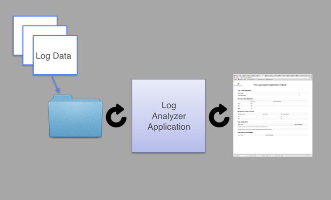

# Logs Analyzer Application

This directory contains code from the chapters, assembled together to form
a sample logs analyzer application.  Other libraries that are not discussed
have been used to make this a more finished application.
These are the features of our MVP (minimal viable product) logs analyzer application:

* Reads in new log files from a directory and inputs those new files into Spark Streaming.
* Compute stats on the logs using Spark - stats for the last 30 seconds are calculated as well as for all of time.
* Write the calculated stats to an html file on the local file system that gets
  refreshed on a set interval.

You can use this simple application as a skeleton and combine features from
the chapters to produce your own custom logs analysis application.  The main
class is [LogAnalyzerAppMain.java](java8/src/main/java/com/databricks/apps/logs/LogAnalyzerAppMain.java).
