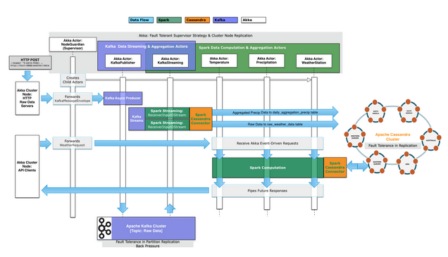

# Overview
## WeatherApp

This is the primary compute application that processes the raw hourly data from the Kafka stream. As soon as each hourly raw data is received on the particular Kafka topic, it is mapped to a custom case class. From there, two initial actions are done:

*  The raw hourly data by weather station ID is stored in Cassandra for use by any other processes that want it in its raw state.
* The daily precipitation aggregate (0 to 23 hours of data) is computed and updated in a daily_aggregate_precipitation table in Cassandra. We can do precipitation in the stream because of the data model created and a Cassandra Counter used. Whereas aggregation of temperature require more input data so this is done by request with a station ID, year, month and day.
*
With things like daily precipitation and temperature aggregates pre-calculated and stored, any requests for annual aggregates, high-low or topK for example, can be easily computed via calls to specific Akka Actors handling each aggregation type (precip, temp, etc).  These read the aggregated and persisted data from Cassandra and runs the computation through Spark. Data is returned to the requester in a Future - no threads are blocked.
[Note, when in master with the correct URL of specific files available I can link them above so that a user can click on a specific block of code]

## WeatherClient
* Represents a separately-deployed process that would typically be feeding data to Kafka and other applications or processes that would be sending data aggregation requests.
* Simulates real-time raw weather events received from a separate process which this sends to Kafka.  It does this as a feed vs bursts on startup. The FileFeedActor in the client receives data per file, parses it to each raw data entry, and pipes the data through Akka Streams to publish to Kafka and handle life cycle.
* Exercises the weather app by sending requests for various aggregated data (topk, high-low, annual…) every n-seconds via the WeatherApiQueries Actor.

## Architecture and Implementation Details

### Asynchronous Fault Tolerant Data Pipeline
Raw hourly data for each weather station is ingested and published to a Kafka topic. This would be distributed on Kafka nodes in each Data Center where the Spark-Cassandra application are also deployed, as are the co-located Spark and Cassandra nodes.

Data is streamed from the Kafka nodes to the Spark Nodes for parallelized distributed data computation. The raw data is initially saved to a Cassandra keyspace and table. This stream from Kafka is then used for daily aggregation work in Spark, which is then persisted to several Cassandra daily aggregate tables. Now, future requests for data based on these daily aggregates (temperature, precipitation..) can now more quickly be computed. For example, requests for topK, high-low or annual precipitation for a specific weather station in a specific year (or year, month, day for high-low/topk) do not need to get the raw data but can start on the already aggregated data via Spark, now available on demand in Cassandra (replicated, fault tolerant and distributed across data centers).
