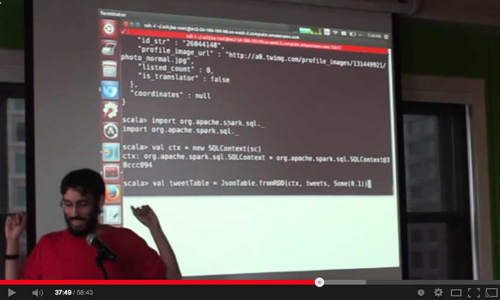

# Twitter Streaming Language Classifier

In this reference application, we show how you can use Apache Spark for training a language classifier - replacing a whole suite of tools you may be currently using.

This reference application was demo-ed at a meetup which is taped here - the link skips straight to demo time, but the talk before that is useful too:

Here are 5 typical stages for creating a production-ready classifier.  Often, each stage is done with a different set of tools and even by different engineering teams:

1. Scrape/collect a dataset.
* Clean and explore the data, doing feature extraction.
* Build a model on the data and iterate/improve it.
* Improve the model using more and more data, perhaps upgrading your infrastructure to support building larger models.  (Such as migrating over to Hadoop.)
* Apply the model in real time.

Spark can be used for all of the above and simple to use for all these purposes.  We've chosen to break up the language classifier into 3 parts with one simple Spark program to accomplish each part:

1. [Collect a Dataset of Tweets](collect.md) - Spark Streaming is used to collect a dataset of tweets and write them out to files.
* [Examine the Tweets and Train a Model](examine_and_train.md) - Spark SQL is used to examine the dataset of Tweets.  Then Spark MLLib is used to apply the K-Means algorithm to train a model on the data.
* [Apply the Model in Real-time](predict.md) - Spark Streaming and Spark MLLib are used to filter a live stream of Tweets for those that match the specified cluster.
